# Lecture 17: Shortest Paths and Dijkstra’s algorithm

>Note: The most of the information of these lectures was extracted and adapted from Dr Bajuelos and from Weiss’s book, “Data Structures and Algorithm Analysis in Java". They are provided for COP3530 students only. Not to be published or publicly distributed without permission by the publisher. 

## Single-Source Shortest-Path Problem.

Let a weighted graph (i.e. associated with each edge (v<sub>i</sub>,v<sub>j</sub>) is a cost c<sub>i,j</sub> to traverse the edge). 

The cost of a path v<sub>1</sub>v<sub>2</sub> . . . v<sub>n</sub> is is the sum of the cost of all the paths ( c<sub>i</sub>) in between. This is referred to as the weighted path length. 

For the unweighted path length is merely the number of edges on the path, namely, n − 1.

### Single-Source Shortest-Path Problem.

Given a weighted graph, G = (V,E), and a distinguished vertex, s, find the shortest weighted path from s to every other vertex in G.

### Example #1

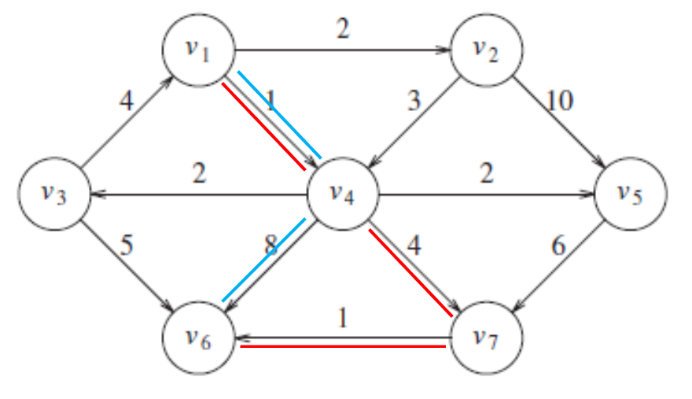

The shortest weighted path from v<sub>1</sub> to v<sub>6</sub> has a cost of 6 and goes from v<sub>1</sub> to v<sub>4</sub> to v<sub>7</sub> to v<sub>6</sub> (red path).

The shortest unweighted path between these vertices is 2 (blue path).

Note: 

For the shortest unweighted path we are only interested in the number of edges contained on the path. This is clearly a special case of the weighted shortest-path problem, since we could assign all edges a weight of 1.


### Example #2: 
> Find a shortest path from s to t.

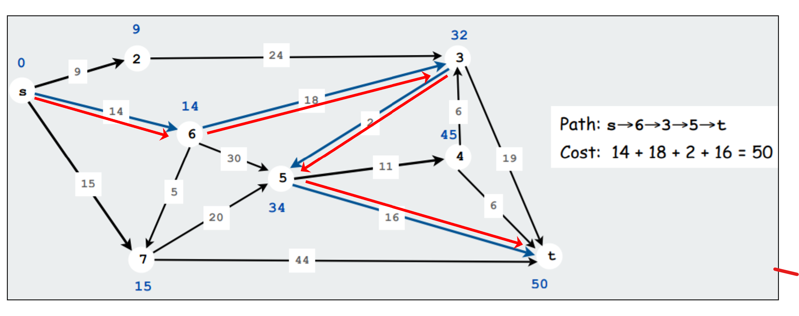

Source:

https://www.cs.princeton.edu/~rs/AlgsDS07/15ShortestPaths.pdf

## Shortest Unweighted Path Problem

Suppose we choose start vertex, s, to be v<sub>3</sub>. The shortest path from s to v<sub>3</sub> is then a path of length 0.

Then we can start looking for all vertices that are a distance 1 away from s (by looking at the vertices that are adjacent to s).

Next: find vertices whose shortest path from s is exactly 2, (by finding all the vertices adjacent to v1 and v6), whose shortest paths are not already known. This search tells us that the shortest path (from s) to v2 and v4 is 2.

Repeat

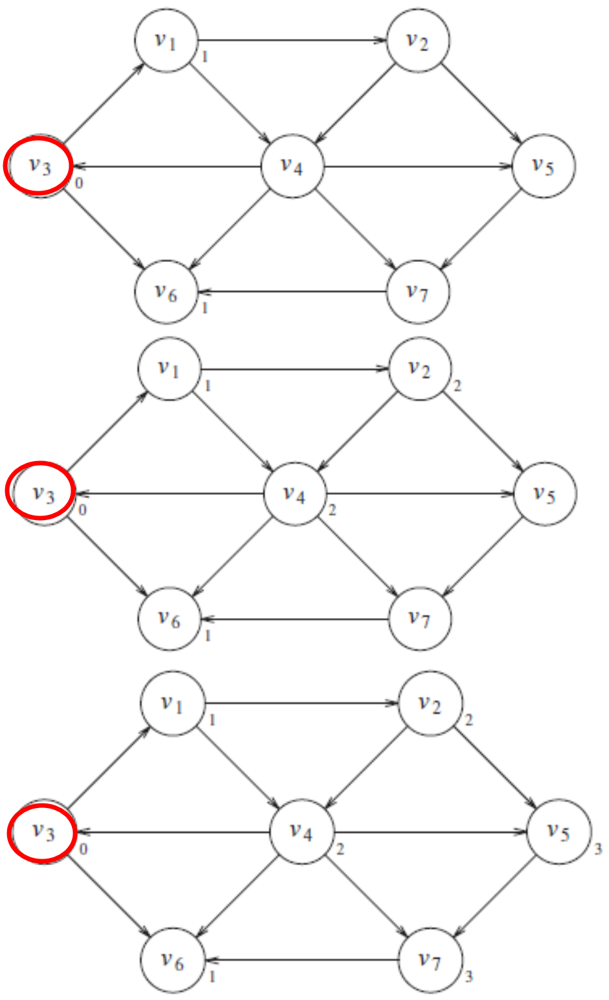

## Some Applications

* Driving directions

* Cheap flight itineraries

* Network routing

* Critical paths in project management

## Shortest Weighted Path. Dijkstra’s Algorithm

### The Problem: 

Given a digraph with non-negative edge weights, G=(V,E), and a distinguished source vertex s in V. 

Determine the distance and a shortest path from the source vertex to every vertex in the digraph.

### Question: 

How do you design an efficient algorithm for this problem?

### Basic Ideas:

Each vertex is marked as either known or unknown. A tentative distance d<sub>v</sub>  is kept for each vertex. 

d<sub>v</sub>  turns out to be the shortest path length from s to v using only known vertices as intermediates. 

We record p<sub>v</sub> , which is the last vertex to cause a change to d<sub>v</sub> .

At each stage, Dijkstra’s algorithm selects a vertex v, which has the smallest d<sub>v</sub>  among all the unknown vertices, and declares that the shortest path from s to v is known.

The remainder of a stage consists of updating the values of d<sub>w</sub> .

Pseudocode:

```text
For each node v, set  v.dist = ∞ and v.known = false

Set source.dist = 0

While there are unknown nodes in the graph
    Select the unknown node v with lowest distance
    Mark v as known
    For each edge (v,u) with weight w,
	c1 = v.dist + w // distance of best path through v to u   
        c2 = u.cost	    // distance of best path to u previously known
        if(c1 < c2)	   // if the path through v is better /shorter
        {      
		u.dist = c1
                u.path = v    // for computing actual paths
	}
```
Example:

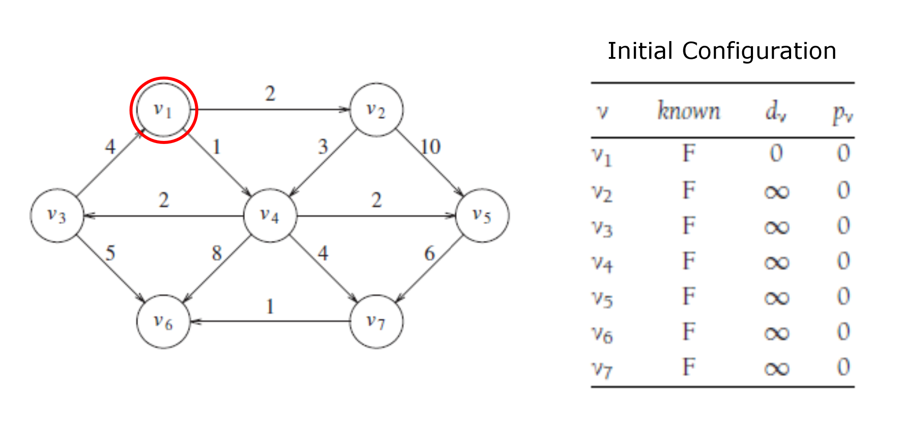

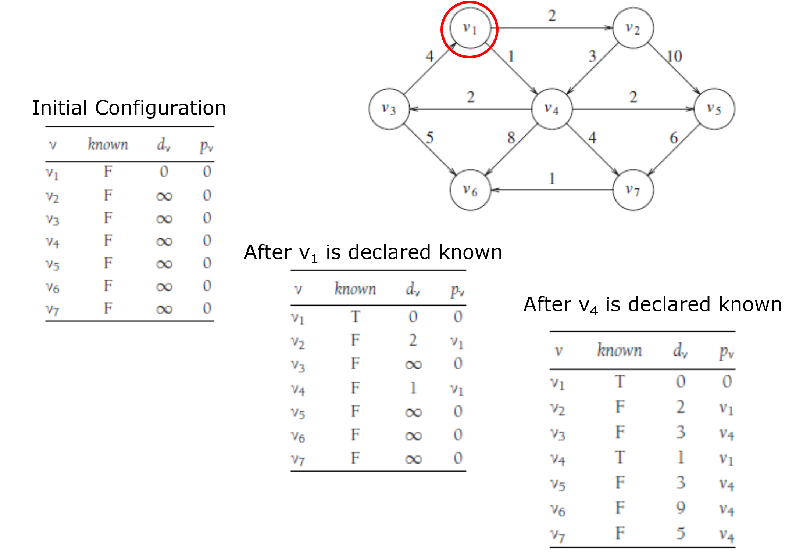

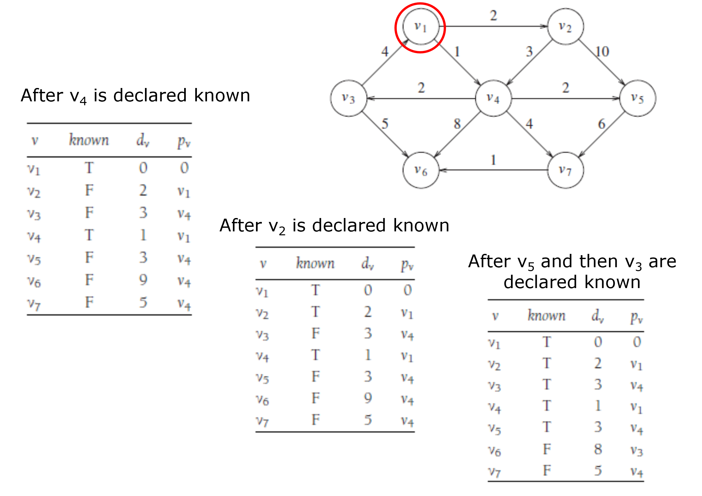

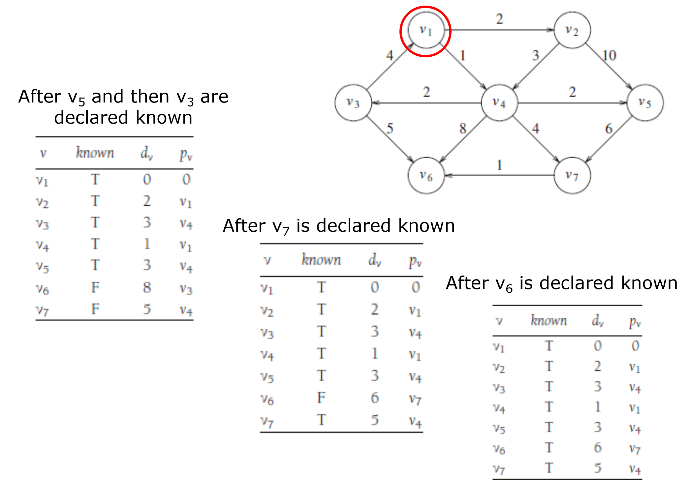

Example: Stages of Dijkstra’s Algorithm


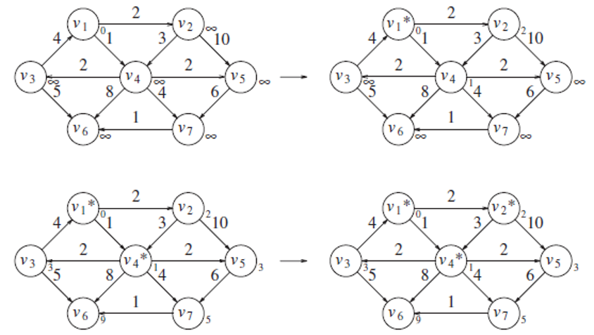

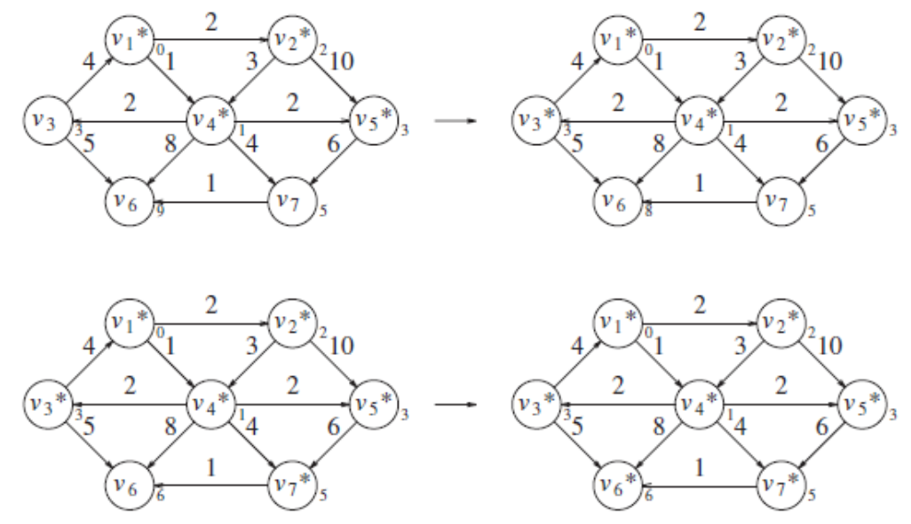

Analyze the following example:


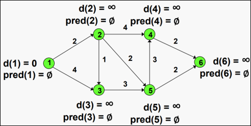

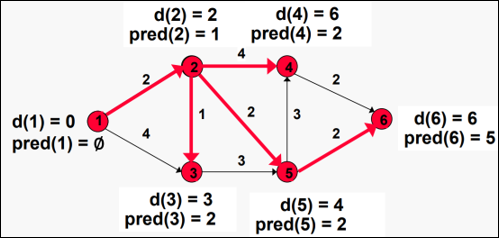

Source:

https://ocw.mit.edu/courses/sloan-school-of-management/15-053-optimization-methods-in-management-science-spring-2013/lecture-notes/MIT15_053S13_lec15.pdf


Efficiency, first approach


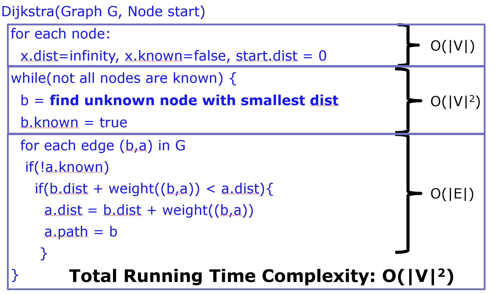

How to improve the O(|V|<sup>2</sup>) of the Dijkstra’s Algorithm?

Hint: use a MinHeap to store the vertices for which shortest distance is not finalized yet.

Recommended Link: 

https://www.youtube.com/watch?v=zXfDYaahsNA

## Example 4

Given a source vertex s from a set of vertices V in a weighted digraph where all its edge weights w(u, v) are non-negative, find the shortest path weights d(s, v) from source s for all vertices v present in the graph.

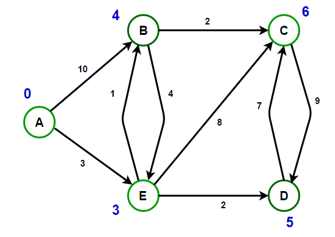

For instance, consider the following graph. We will start with vertex A, So vertex A has a distance 0, and the remaining vertices have an undefined (infinite) distance from the source. Let S be the set of vertices whose shortest path distances from the source are already calculated.

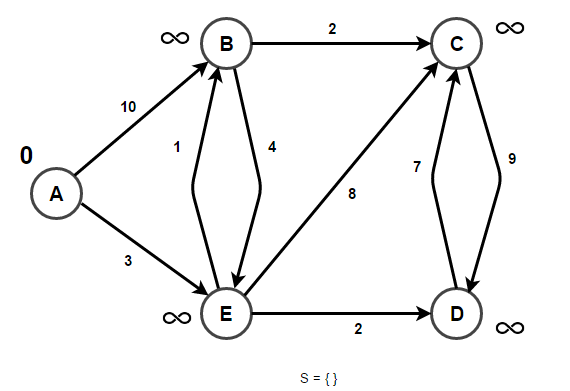

Initially, S contains the source vertex. S = {A}.

We start from source vertex A and start relaxing A's neighbors. Since vertex B can be reached from a direct edge from vertex A, update its distance to 10 (weight of edge A–B). Similarly, we can reach vertex E through a direct edge from A, so we update its distance from INFINITY to 3.

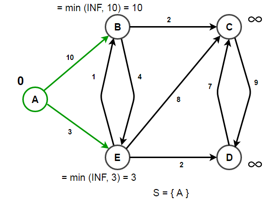

After processing all outgoing edges of A, we next consider a vertex having minimum distance. B has a distance of 10, E has distance 3, and all remaining vertices have distance INFINITY. So, we choose E and push it into set S. Now our set becomes S = {A, E}. Next, we relax with E's neighbors. E has 2 neighbors B and C. We have already found one route to vertex B through vertex A having cost 10. But if we visit a vertex B through vertex E, we are getting an even cheaper route, i.e., (cost of edge A–E + cost of edge E–B) = 3 + 1 = 4 < 10 (cost of edge A–B).

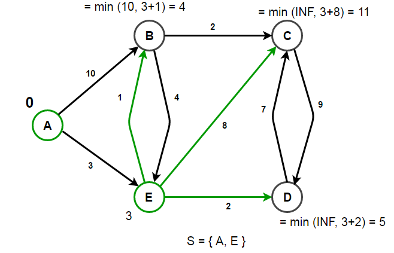

We repeat the process till we have processed all the vertices, i.e., Set S becomes full.

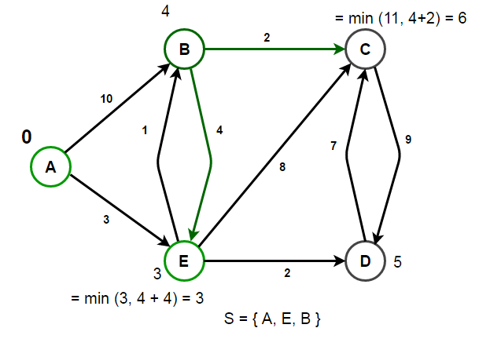


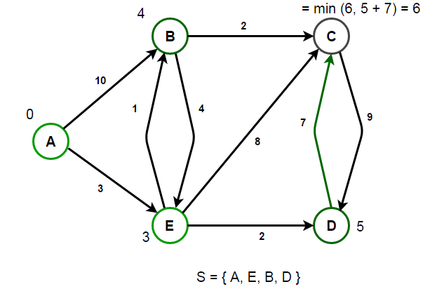

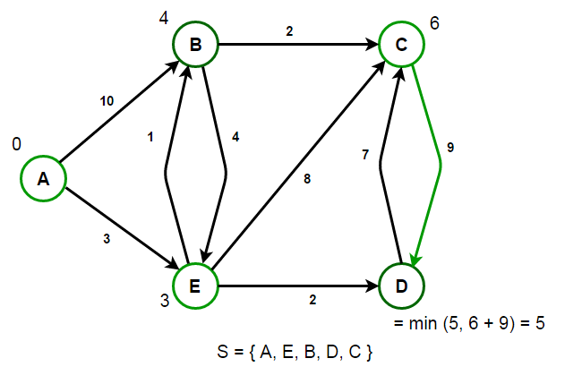


## Link with robots

https://youtu.be/EFg3u_E6eHU

## Shortest paths with negative weights: failed examples!

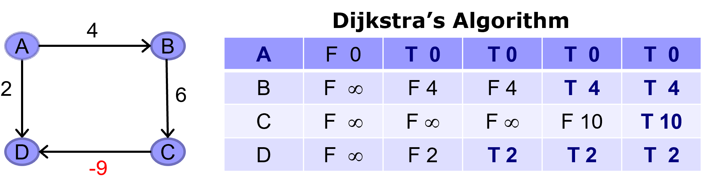

### Dijkstra Solution:

Shortest path (A,D) = [A,D] = 2

### Correct solution:

Shortest path (A,D) = [A,B,C,D] = 1 !!!


## Re-weighting. 

Adding a constant to every edge weight also doesn’t work.

### Dijkstra Solution:

Shortest path (A,D) = [A,D] = 11

### Correct solution (in the original graph):

Shortest path (A,D) = [A,B,C,D] = 1 !!!


## Implementation

```java
import java.util.*;
 
// A class to store a graph edge
class Edge
{
    int source, dest, weight;
 
    public Edge(int source, int dest, int weight)
    {
        this.source = source;
        this.dest = dest;
        this.weight = weight;
    }
}
 
// A class to store a heap node
class Node
{
    int vertex, weight;
 
    public Node(int vertex, int weight)
    {
        this.vertex = vertex;
        this.weight = weight;
    }
}
 
// A class to represent a graph object
class Graph
{
    // A list of lists to represent an adjacency list
    List<List<Edge>> adjList = null;
 
    // Constructor
    Graph(List<Edge> edges, int n)
    {
        adjList = new ArrayList<>();
 
        for (int i = 0; i < n; i++) {
            adjList.add(new ArrayList<>());
        }
 
        // add edges to the directed graph
        for (Edge edge: edges) {
            adjList.get(edge.source).add(edge);
        }
    }
}
 
class Main
{
    private static void getRoute(int[] prev, int i, List<Integer> route)
    {
        if (i >= 0)
        {
            getRoute(prev, prev[i], route);
            route.add(i);
        }
    }
 
    // Run Dijkstra’s algorithm on a given graph
    public static void findShortestPaths(Graph graph, int source, int n)
    {
        // create a min-heap and push source node having distance 0
        PriorityQueue<Node> minHeap;
        minHeap = new PriorityQueue<>(Comparator.comparingInt(node -> node.weight));
        minHeap.add(new Node(source, 0));
 
        // set initial distance from the source to `v` as infinity
        List<Integer> dist;
        dist = new ArrayList<>(Collections.nCopies(n, Integer.MAX_VALUE));
 
        // distance from the source to itself is zero
        dist.set(source, 0);
 
        // boolean array to track vertices for which minimum
        // cost is already found
        boolean[] done = new boolean[n];
        done[source] = true;
 
        // stores predecessor of a vertex (to a print path)
        int[] prev = new int[n];
        prev[source] = -1;
 
        // run till min-heap is empty
        while (!minHeap.isEmpty())
        {
            // Remove and return the best vertex
            Node node = minHeap.poll();
 
            // get the vertex number
            int u = node.vertex;
 
            // do for each neighbor `v` of `u`
            for (Edge edge: graph.adjList.get(u))
            {
                int v = edge.dest;
                int weight = edge.weight;
 
                // Relaxation step
                if (!done[v] && (dist.get(u) + weight) < dist.get(v))
                {
                    dist.set(v, dist.get(u) + weight);
                    prev[v] = u;
                    minHeap.add(new Node(v, dist.get(v)));
                }
            }
 
            // mark vertex `u` as done so it will not get picked up again
            done[u] = true;
        }
 
        List<Integer> route = new ArrayList<>();
 
        for (int i = 0; i < n; i++)
        {
            if (i != source && dist.get(i) != Integer.MAX_VALUE)
            {
                getRoute(prev, i, route);
                System.out.printf("Path (%d —> %d): Minimum cost = %d, Route = %s\n",
                                source, i, dist.get(i), route);
                route.clear();
            }
        }
    }
 
    public static void main(String[] args)
    {
        // initialize edges as per the above diagram
        // (u, v, w) represent edge from vertex `u` to vertex `v` having weight `w`
        List<Edge> edges = Arrays.asList(
                new Edge(0, 1, 10), new Edge(0, 4, 3), new Edge(1, 2, 2),
                new Edge(1, 4, 4), new Edge(2, 3, 9), new Edge(3, 2, 7),
                new Edge(4, 1, 1), new Edge(4, 2, 8), new Edge(4, 3, 2)
        );
 
        // total number of nodes in the graph (labelled from 0 to 4)
        int n = 5;
 
        // construct graph
        Graph graph = new Graph(edges, n);
 
        // run the Dijkstra’s algorithm from every node
        for (int source = 0; source < n; source++) {
            findShortestPaths(graph, source, n);
        }
    }
}

```

## Class Problem

Solve this graph using Dijkstra’s algorithm and describe the steps.

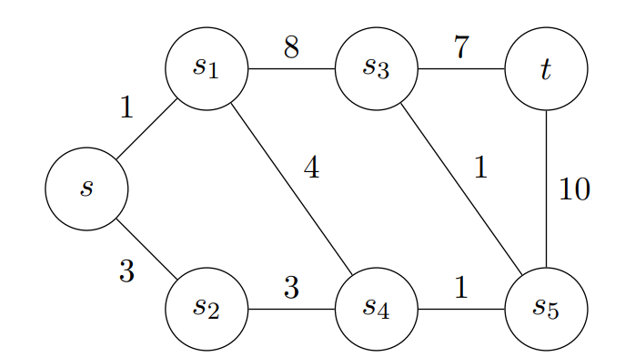

Is this shortest path?

Path: s, s<sub>1</sub>, s<sub>4</sub>, s<sub>5</sub>, s<sub>3</sub>, t; Cost: 14.
